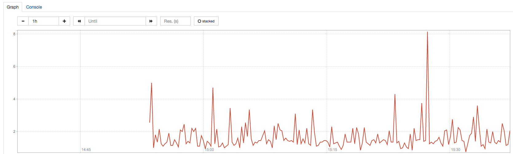

# StackState Agent Integrations Software Engineer

## Introduction

StackState is a product that integrates data from many different sources into a single, real-time picture of your IT landscape. You can take a look at our overview [here](https://videos.ctfassets.net/ud9dfq0vudar/43ivrn4Ktghcbqxh8fI0h6/7d1e993714a72c5f15ebc22af86bff45/Observability_for_Cloud_Native_Applications_and_Environments.mp4)

StackState collects a couple of different data types: 

### Topology
Topology is a visual representation of all components and relations in your IT landscape. 

Topology is composed of `Components` and `Relations`

### Metrics
One of the data types that StackState processes are **metrics**, data series that describe a particular characteristic over time (see: [https://en.wikipedia.org/wiki/Time_series](https://en.wikipedia.org/wiki/Time_series)). For example, here is a graph of a metric that describes the CPU idle percentage over time:



### Events
Events are a single point of interest at a given time. In StackState these are typically presented as `changes` to your environment that can help with `RCA` and correlating changes to failures which is one of the key features of StackState.

## Assessment Overview

Create a `Weather Check` that produces weather information for all the cities defined in the check config. 

### Prerequisites
We recommend setting up a python virtual environment and installing the requirements for the Agent Check Base.
```
pip install -r requirements.txt
```

You will have to [sign up](https://www.weatherapi.com/signup.aspx) and get an API token for WeatherAPI.

For some more documentation about creating an Agent Check, head over to our [docs](https://docs.stackstate.com/develop/developer-guides/agent_check/how_to_develop_agent_checks) or check out the [Agent Check API](https://docs.stackstate.com/develop/developer-guides/agent_check/agent-check-api)

### Requirements

The `Weather Check` should satisfy the following requirements
- Produce a `Component` for each city.
- Produce a `metric` for the current weather information of the Realtime Weather API.
- (Bonus Point) Using the Forecast Weather API, produce a weather alert as an `event` for each city.

## Solution Packaging

We would like you to package your solution into a docker image and create a Kubernetes deployment for it. Pick one of the following deployments for your solution:

- Helm Chart
- Kubernetes manifests

## Notes

At StackState we value testing and QA very highly. Make sure your code is well tested covering various levels of the testing pyramid. Consider this solution as something that needs to be shipped to production, thus making it easily debug-able and maintainable in the future by other developers. Amongst other things include logging as well as comments describing your code.

## Delivery

Deliver your solution in the form of a git repository with a README.